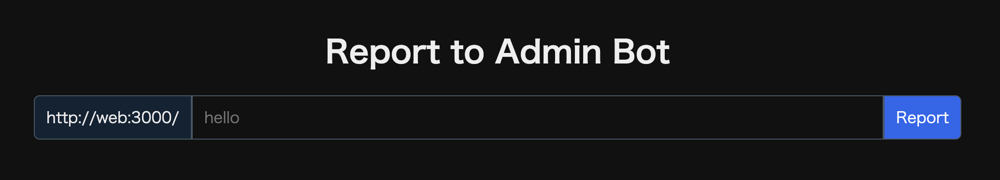

# Admin Bot

## 概要

このリポジトリは、CTF の Web 問でよく使う admin bot のテンプレートです。

この bot に URL パスを報告すると、bot は Chromium を起動し、そのページへアクセスします。
プレイヤーは問題サーバー側の脆弱性を使って、admin のブラウザ上で特定の挙動を起こすことを目指します。

典型的な目標は、Admin Bot に自分の用意した payload を実行させて、cookie の内容を外部へ送らせることです。
送信先は、 HTTP リクエストを受け取って内容を確認できるサービス（[Webhook.site](https://webhook.site/) 等）を使うと楽ですが、自分で立てたサーバーでも構いません。

## 画面の役割

`/` にアクセスすると、`Report to Admin Bot` という小さなフォームが表示されます。



画面には、問題サーバーのURLである `http://web:3000/` が接頭辞として表示され、その右側に `path` を入力できます。

入力欄に `hello` と入れて `Report` ボタンを押すと、bot は次の URL を訪問します。

```text
http://web:3000/hello
```

## 処理の流れ

このテンプレートでは、bot は次の流れで動作します。

1. `/api/report` で `path` を受け取る
2. Puppeteer が Chromium を起動する
3. `APP_URL` のホストに `FLAG` cookie をセットする
4. 指定された URL `APP_URL + path` にアクセスする
5. 5 秒待ってブラウザを閉じる

重要なのは、アクセスする前に次の cookie を設定している点です。

```js
await page.setCookie({
  name: "FLAG",
  value: FLAG,
  domain: new URL(APP_URL).hostname,
  path: "/",
});
```

つまり `APP_URL=http://web:3000/` なら、`web` ホスト向けの `FLAG` cookie が admin のブラウザに設定されます。

## XSS 問

このような bot は、典型的には Cross-Site Scripting (XSS) 問で使われます。

この bot では、`FLAG` cookie が `APP_URL` のホストにセットされています。
cookie が JavaScript から読める設定であれば、`document.cookie` などを使って `FLAG` を取得できます。

取得した `FLAG` は、その場で画面に表示されないので、外部の受信先へ送らなくてはなりません。
例えば、リクエスト確認用サービスの URL にアクセスさせる、または、自分のサーバーにリクエストを送るという形です。

例として、問題サーバーに次のような脆弱なページがあるとします。

```text
http://web:3000/search?q=<script>...</script>
```

report 画面に次のような `path` を送ります。

```text
search?q=<script>...</script>
```

bot は `http://web:3000/search?...` を `FLAG` cookie 付きで開くため、payload が admin のブラウザで動きます。

payload の中で、例えば `document.cookie` を読み、それを外部 URL のクエリに載せて送信します。
実際の payload は問題の内容によって変わります。

## 制約

このテンプレートでは、 `path` は `APP_URL` に連結します。

```js
const url = APP_URL + path;
```

そのため、基本的には bot は問題サーバー配下の URL を訪問します。
プレイヤーが外部 URL をそのまま指定する設計ではありません。

また、このテンプレートではページを開いてから 5 秒で閉じます。
payload はその時間内に動作する必要があります。

これら制約は問題によって変わり得るものです。
